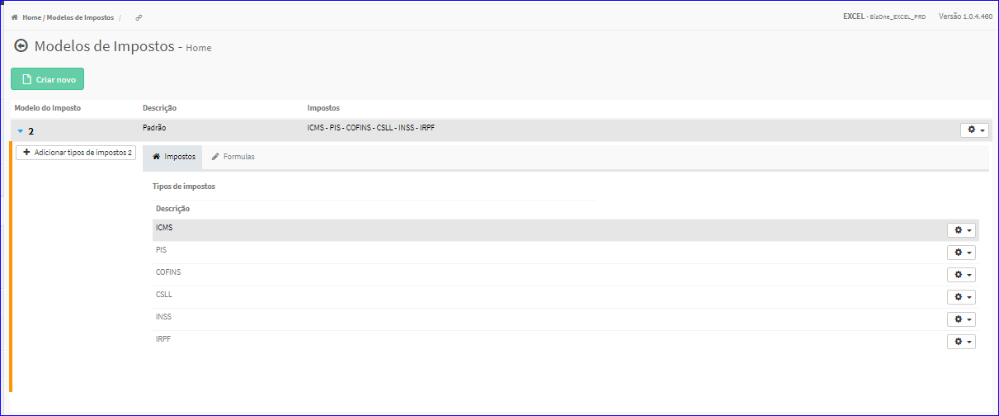
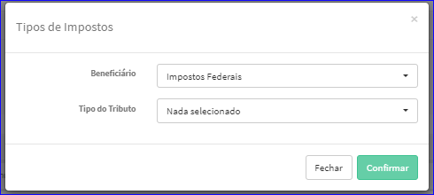

Criar Tipos de Impostos
#######################
- Permite a criação de um novo Tipo de Imposto dentro de um Modelo de Imposto.

- Essa opção é chamada através do botão **Adicionar tipos de impostos** da Lista dos itens dos Modelos de Impostos.

|imagem16|

- Após clicar no botão, o sistema irá abrir uma nova tela para a criação do tipo.

|imagem5|
   * Após informado corretamente os dados e clicado em **Confirmar**, o sistema atualizará a lista dos Tipos de Impostos.

|imagem4|

.. |imagem16| image:: imagens/Modelos_Impostos_16.png
