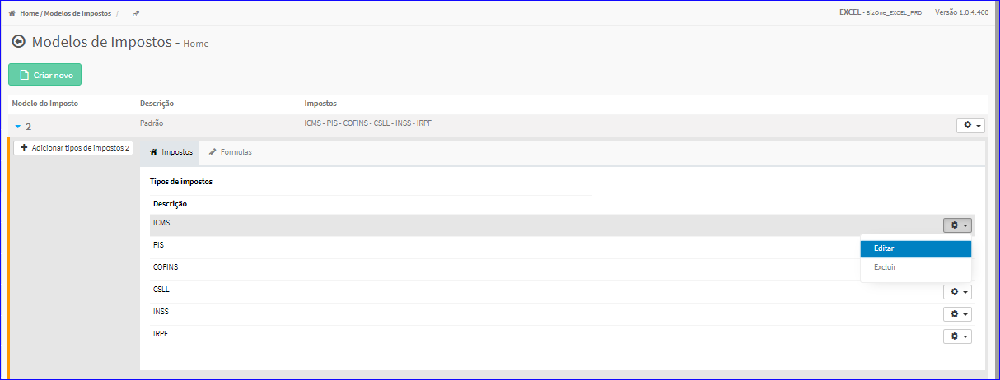
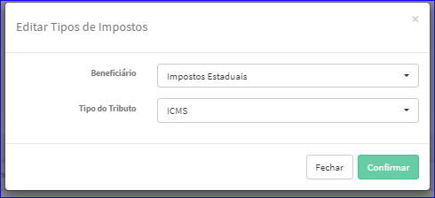
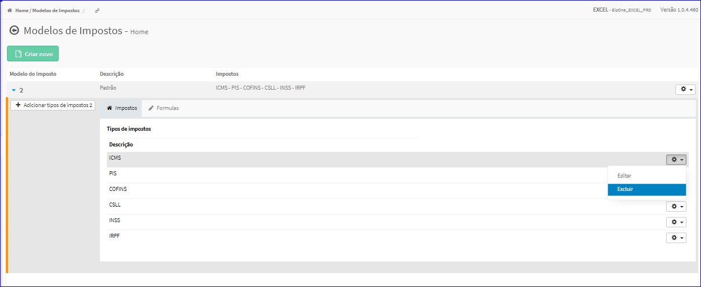
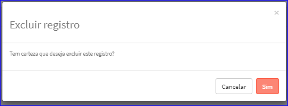

Criar Tipos de Impostos
#######################
- Permite a criação de um novo Tipo de Imposto dentro de um Modelo de Imposto.

- Essa opção é chamada através do botão **Adicionar tipos de impostos** da Lista dos itens dos Modelos de Impostos.

|imagem16|

- Após clicar no botão, o sistema irá abrir uma nova tela para a criação do tipo.

|imagem5|
   * Após informado corretamente os dados e clicado em **Confirmar**, o sistema atualizará a lista dos Tipos de Impostos.

|imagem4|

- **Editar Tipo de Imposto**
   - Para isso, basta selecionar um Tipo de Imposto da Lista e ir até a Engrenagem situada à direita e escolher a opção **Editar**.

|imagem6|
   - Após o sistema irá abrir uma nova tela com o Tipo de Imposto escolhido anteriormente.

|imagem7|
   - Após alterados os dados e clicado em **Confirmar**, o sistema atualizará a lista.

- **Excluir Tipo de Imposto**
   - Para isso, basta selecionar um Tipo de Imposto da Lista e ir até a Engrenagem situada à direita e escolher a opção **Excluir**.

|imagem8|
   - Após escolhido o Tipo de Imposto o sistema irá questionar o usuário quanto ao registro.

|imagem9|
   - Depois de clicado em **Sim** o sistema atualizará a lista.

.. |imagem4| image:: imagens/Modelos_Impostos_4.png

.. |imagem5| image:: imagens/Modelos_Impostos_5.png

.. |imagem16| image:: imagens/Modelos_Impostos_16.png
