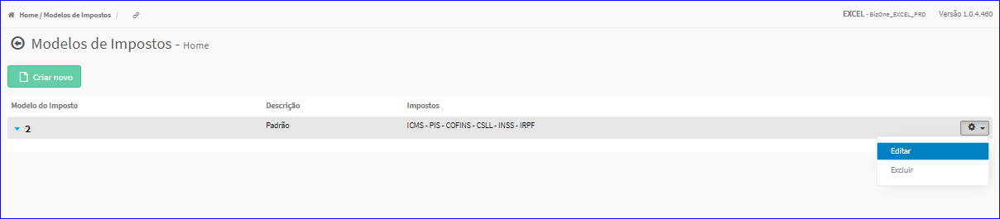
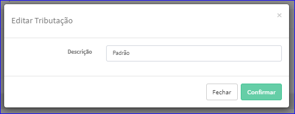

Editar Modelo Imposto
#####################
- A tela da Edição permite alterar os dados de um Modelo de Imposto.

- Esta tela é chamada através da Lista dos Modelos de Impostos exibida na tela principal do Cadastro.
- Para isso, basta selecionar um Município da Lista e ir até a Engrenagem situada à direita e escolher a opção **Editar**.

|imagem12|
   - Após o sistema irá abrir uma nova tela com o Modelo de Imposto escolhido anteriormente.   

|imagem13|
   - Após alterados os dados e clicado em **Confirmar**, o sistema atualizará a lista.

