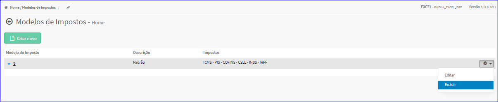
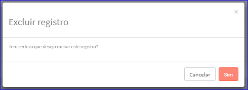

Excluir Modelo Imposto
######################
- Esta opção é chamada através da Lista dos Modelos de Impostos exibida na tela principal do Cadastro.
- Para isso, basta selecionar um Modelo de Imposto da Lista e ir até a Engrenagem situada à direita e escolher a opção **Excluir**.

|imagem14|
   - Após escolhido o Modelo de Imposto o sistema irá questionar o usuário quanto ao registro.

|imagem15|
   - Depois de clicado em **Sim** o sistema atualizará a lista.

