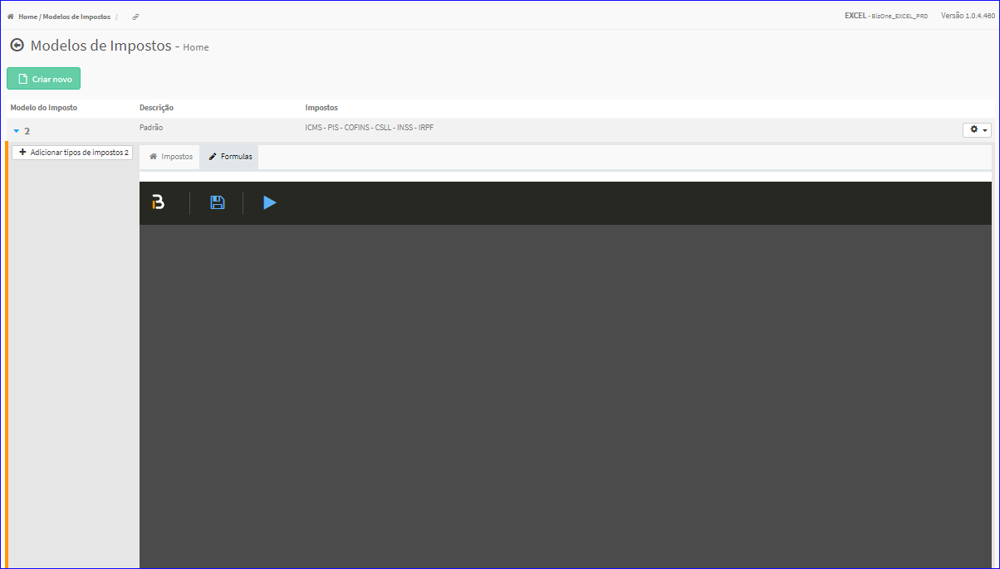
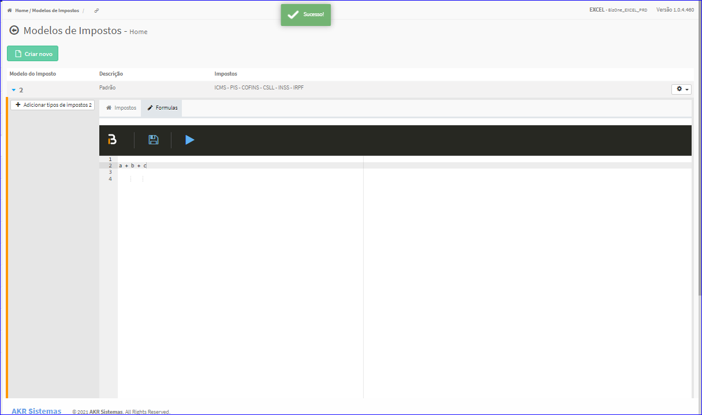

Fórmulas dos Modelos de Impostos
################################
- Permite a criação de Fórmulas que serão vinculadas ao Modelo de Imposto.

- Essa opção é chamada através aba Fórmulas que está dentro da Lista dos Modelos de Impostos.
- Basta clicar no símbolo do disquete e inserir a fórmula.

|imagem10|

- Após a inserção da fórmula, clique novamente no símbolo do disquete para salvar os dados.

|imagem11|

