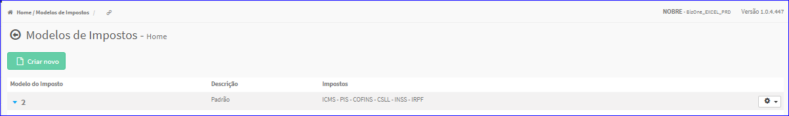

Modelos Impostos
################
No Menu (Superior ou Esquerdo) acesse a opção **Cadastros -> Tributação -> Modelos Impostos**.
   * O sistema irá apresentar uma tela conforme exemplo abaixo.

|imagem1|
   * Tela sem nenhum modelo de imposto cadastrado.

|imagem2|
   - Tela com modelos de imposto cadastrados.

.. toctree::
   :maxdepth: 2

   criar_modelos_impostos
   criar_tipos_modelos_impostos
   formulas_modelos_impostos
   editar_modelos_impostos
   excluir_modelos_impostos

.. |imagem2| image:: imagens/Modelos_Impostos_2.png
