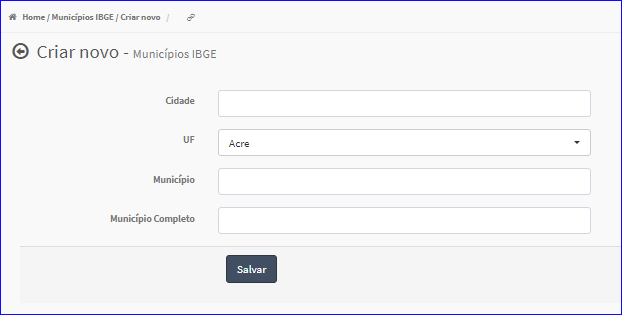

Criar Município IBGE
####################
- Permite a criação de um novo Município.

- Essa opção é chamada através do botão **Criar Novo** da tela principal do Cadastro de Municípios.

|imagem1|

- Após clicar no botão, o sistema irá abrir uma nova tela para a criação do cadastro.

|imagem5|
   * Após informado corretamente os dados e clicado em **Salvar**, o sistema atualizará a lista dos Municípios.

.. |imagem1| image:: imagens/Municipios_IBGE_1.png

