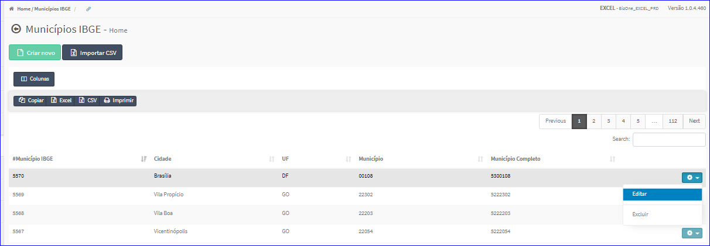
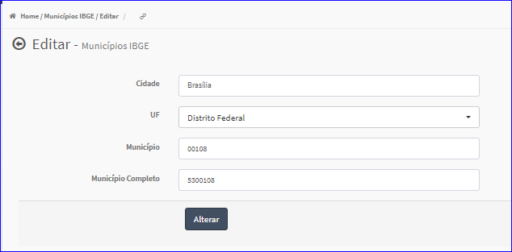

Editar Município IBGE
#####################
- A tela da Edição permite alterar os dados de um Município.

- Esta tela é chamada através da Lista dos Municípios exibida na tela principal do Cadastro.
- Para isso, basta selecionar um Município da Lista e ir até a Engrenagem situada à direita e escolher a opção **Editar**.

|imagem8|
   - `Funções da Lista <lista_municipios_ibge.html#section>`__
   - Após o sistema irá abrir uma nova tela com o Município escolhido anteriormente.   

|imagem9|
   - Após alterados os dados e clicado em **Alterar**, o sistema atualizará a lista.

