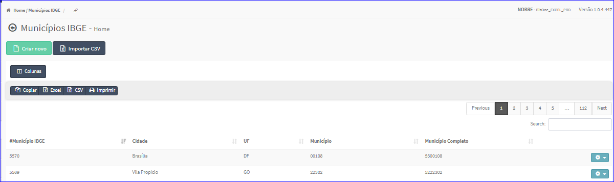
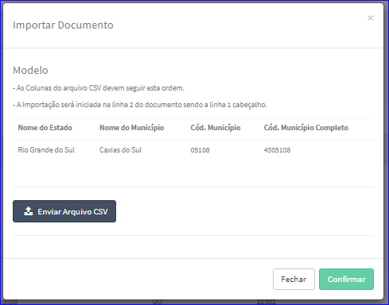
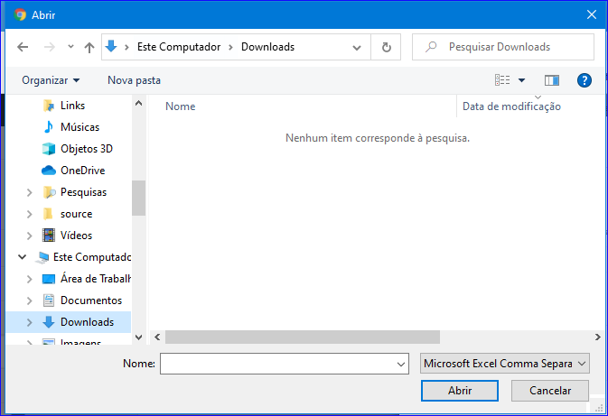

Importar CSV
############
- Esta opção permite que o usuário faça uma importação dos dados do Município.

- Para isso, basta clicar no botão **Importar CSV** da tela Principal do Cadastro.

|imagem1|
   - Após, o sistema abrirá uma nova tela para a escolha do arquivo.

|imagem6|
   - Para importar o usuário deverá clicar no botão **Enviar Arquivo CSV**.
   - O sistema irá abrir uma janaela para escolha de um arquivo.

|imagem7|
   - Após escolher o arquivo, basta clicar em **Confirmar**.

