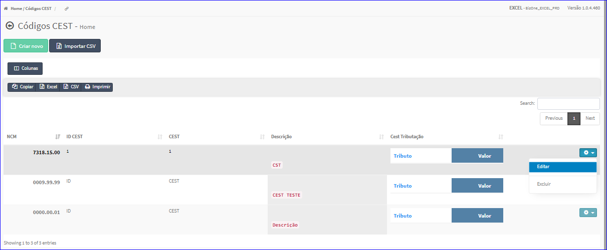
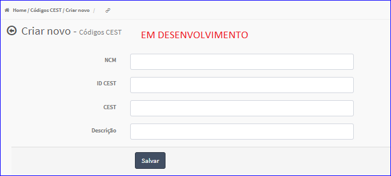

Editar NCM/CEST
###############
- A tela da Edição permite alterar os dados de uma NCM/CEST.

- Esta tela é chamada através da Lista das NCM/CEST exibida na tela principal do Cadastro.
- Para isso, basta selecionar uma NCM/CESTda Lista e ir até a Engrenagem situada à direita e escolher a opção **Editar**.

|imagem11|
   - `Funções da Lista <lista_ncm_cest.html#section>`__
   - Após o sistema irá abrir uma nova tela com a NCM/CEST escolhida anteriormente.   

|imagem12|
   - Após alterados os dados e clicado em **Alterar**, o sistema atualizará a lista.

