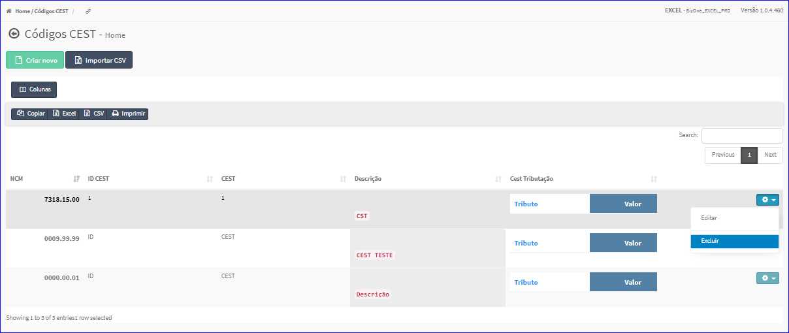

Excluir NCM/CEST
################
- Esta opção é chamada através da Lista das NCM/CEST exibida na tela principal do Cadastro.
- Para isso, basta selecionar uma NCM/CEST da Lista e ir até a Engrenagem situada à direita e escolher a opção **Excluir**.

|imagem13|
   - `Funções da Lista <lista_ncm_cest.html#section>`__
   - Após escolhido a NCM/CEST o sistema irá questionar o usuário quanto ao registro.

|imagem14|
   - Depois de clicado em **Sim** o sistema atualizará a lista.

.. |imagem14| image:: imagens/NCM_CEST_14.png
