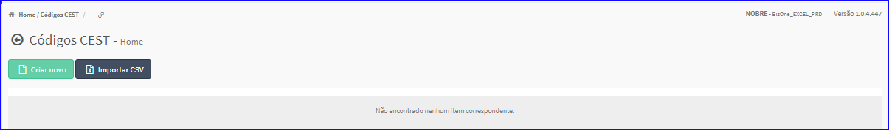
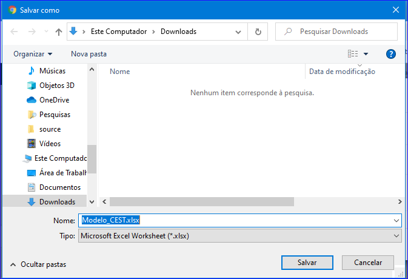
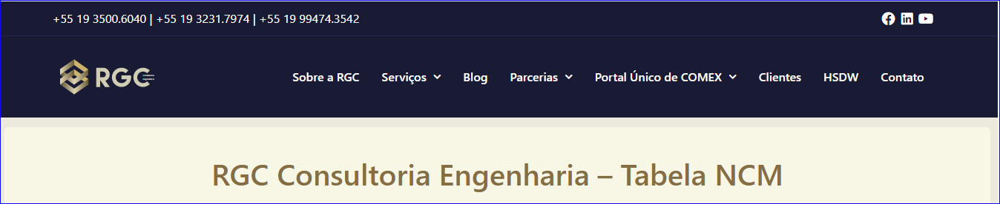

Importar CSV
############
- Permite importar modelo de NCM/CEST.

- Essa opção é chamada através do botão **Importar CSV** da tela principal do Cadastro de NCM/CEST.

|imagem1|

- Após clicar no botão, o sistema irá abrir uma nova tela.

|imagem7|
   - **Download Modelo**
   - Abrirá a tela para escolher um local para baixar o arquivo.
   
|imagem8|

   - **Planilha Atualizada**
   - Abrirá o site da RGC.

|imagem9|

   - **Enviar Arquivo CSV**
   - Abrirá uma tela para escolher um arquivo para vincular os dados de uma NCM/CEST.

.. |imagem7| image:: imagens/NCM_CEST_7.png

