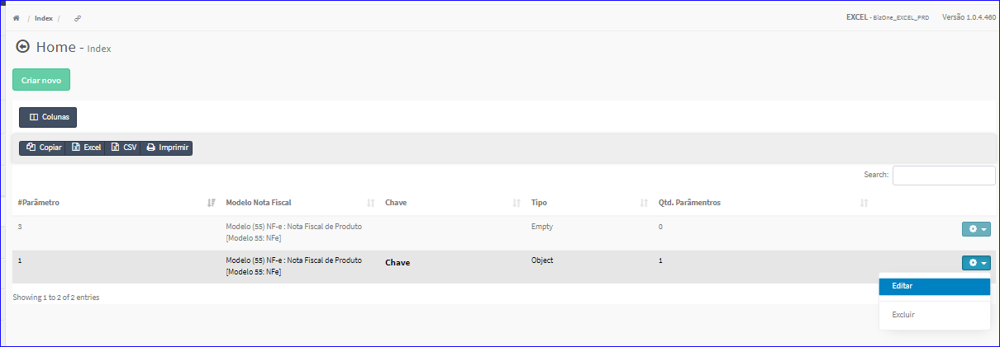
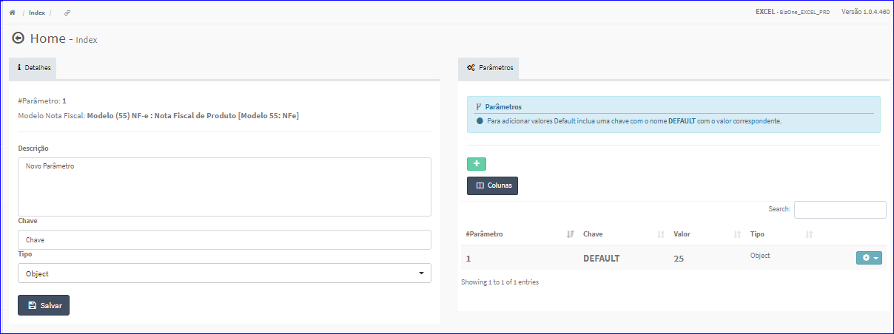
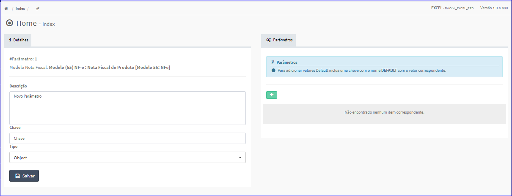
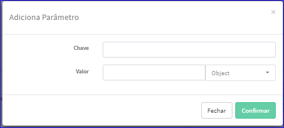
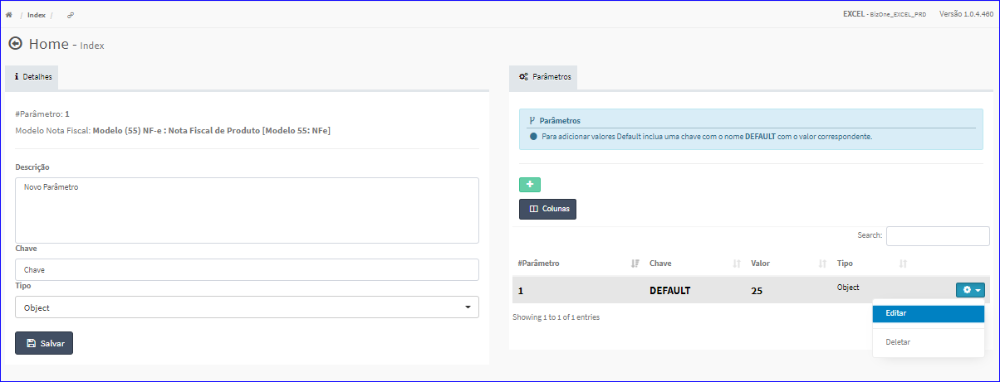
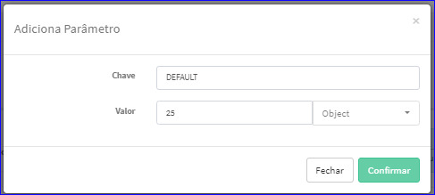
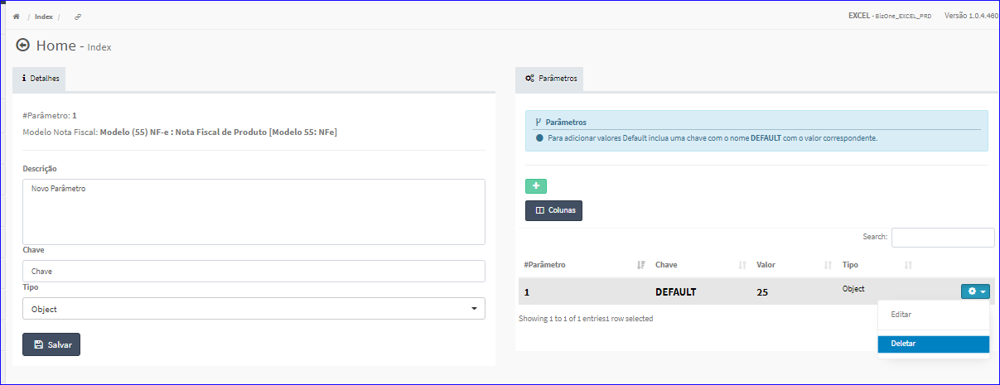
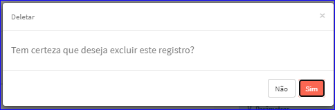

Editar Parâmetro
################
- A tela da Edição permite alterar os dados de um Parâmetro.

- Esta tela é chamada através da Lista dos Parâmetros exibida na tela principal do Cadastro.
- Para isso, basta selecionar uma Composição da Lista e ir até a Engrenagem situada à direita e escolher a opção **Editar**.

|imagem7|
   - `Funções da Lista <lista_parametros.html#section>`__
   - Após o sistema irá abrir uma nova tela com o Parâmetro escolhido anteriormente.   

|imagem8a|
   - Exemplo da tela sem uma Lista de Parâmetros.

- **Adicionar Parâmetro**
   - Esta opção é chamada através do botão **+** da aba Parâmetros e abrirá uma nova tela para informar os dados.

|imagem9|
   - Após informar os dados e clicar em **Confirmar** a lista será atualizada.

|imagem8|
   - `Funções da Lista Parâmetros <lista_itens_parametros.html#section>`__

- **Editar Item Parâmetro**
   - Esta tela é chamada através da Lista dos Itens dos Parâmetros exibida na tela da Edição dos Parâmetros.
   - Para isso, basta selecionar um Parâmetro da Lista e ir até a Engrenagem situada à direita e escolher a opção **Editar**.

|imagem11|
   - O sistema abrirá uma nova tela para ajustar os dados.

|imagem12|
   - Após alterados os dados e clicado em **Confirmar**, o sistema atualizará a lista.

- **Excluir Item Parâmetro**
   - Esta tela é chamada através da Lista dos Itens dos Parâmetros exibida na tela da Edição dos Parâmetros.
   - Para isso, basta selecionar um Parâmetro da Lista e ir até a Engrenagem situada à direita e escolher a opção **Deletar**.

|imagem13|
   - Após escolhido o Parâmetro o sistema irá questionar o usuário quanto ao registro.

|imagem14|
   - Após alterados os dados e clicado em **Sim**, o sistema atualizará a lista.
 
- O botão **Salvar** irá atualizar todas as modificações efetuadas.

