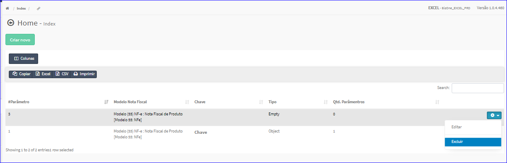
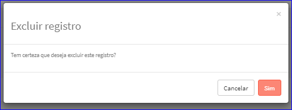

Excluir Parâmetro
#################
- Esta opção é chamada através da Lista dos Parâmetros exibida na tela principal do Cadastro.
- Para isso, basta selecionar um Parâmetro da Lista e ir até a Engrenagem situada à direita e escolher a opção **Excluir**.

|imagem15|
   - `Funções da Lista <lista_parametros.html#section>`__
   - Após escolhido o Parâmetro o sistema irá questionar o usuário quanto ao registro.

|imagem16|
   - Depois de clicado em **Sim** o sistema atualizará a lista.

