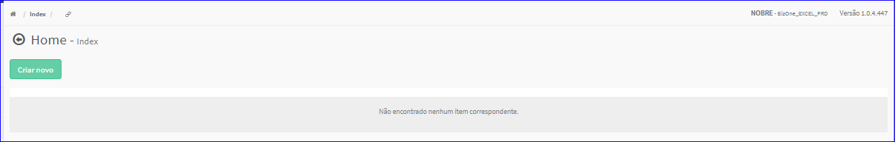
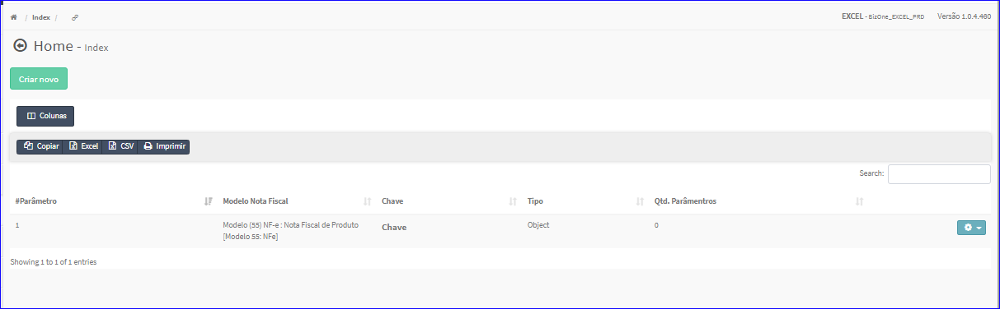

Parâmetros
##########
No Menu (Superior ou Esquerdo) acesse a opção **Cadastros -> Tributação -> Parâmetros**.
   * O sistema irá apresentar uma tela conforme exemplo abaixo.

|imagem1|
   * Tela sem nenhum parâmetro cadastrado.

|imagem2|
   - Tela com parâmetros cadastrados.

.. toctree::
   :maxdepth: 2

   criar_parametros
   editar_parametros
   excluir_parametros

