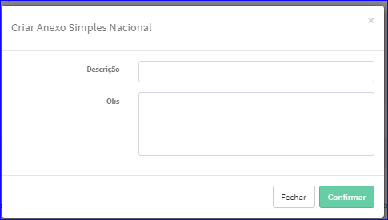

Criar Simples Nacional
######################
- Permite a criação de um novo Simples Nacional.

- Essa opção é chamada através do botão **Criar Novo** da tela principal do Cadastro de Simples Nacional.

|imagem1|

- Após clicar no botão, o sistema irá abrir uma nova tela para a criação do cadastro.

|imagem5|

- Após informado corretamente os dados e clicado em **Confirmar**, o sistema abrirá a tela de Edição do Simples Nacional.

.. |imagem1| image:: imagens/Simples_Nacional_1.png

