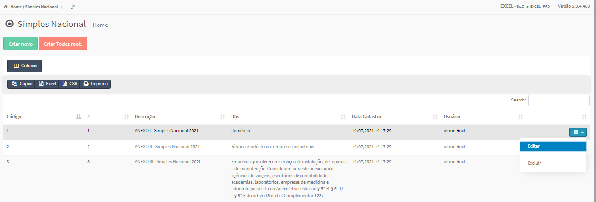
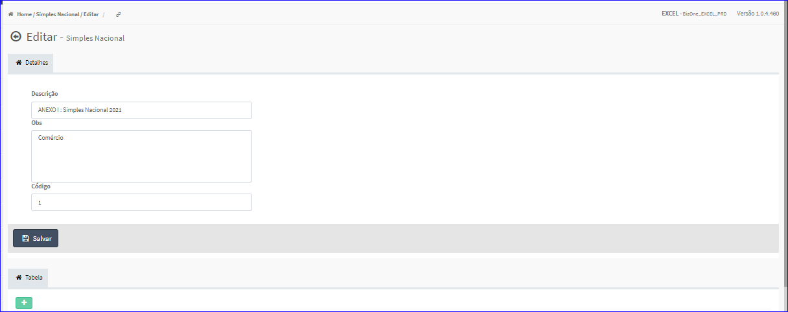
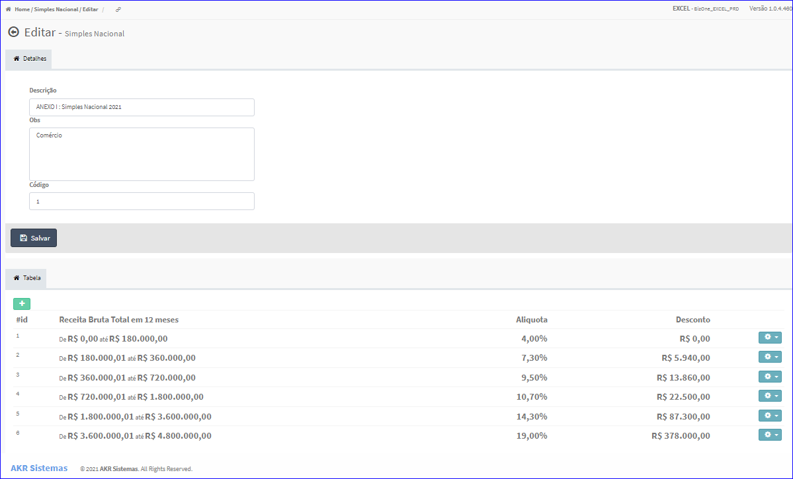
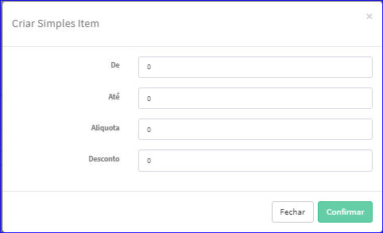
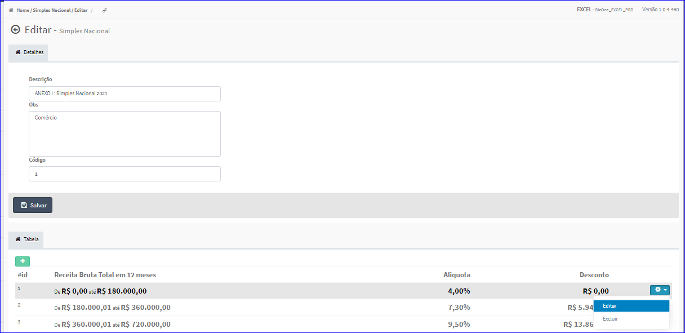
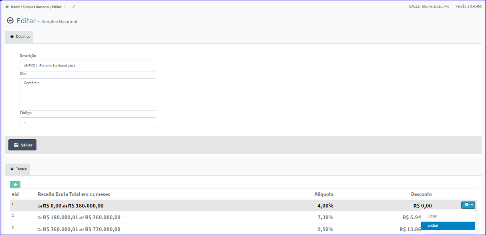
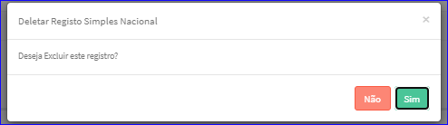

Editar Simples Nacional
#######################
- A tela da Edição permite alterar os dados de um Simples Nacional.

- Esta tela é chamada através da Lista do Simples Nacional exibida na tela principal do Cadastro.
- Para isso, basta selecionar um Simples Nacional Lista e ir até a Engrenagem situada à direita e escolher a opção **Editar**.

|imagem7|
   - `Funções da Lista <lista_simples_nacional.html#section>`__
   - Após o sistema irá abrir uma nova tela com o Simples Nacional escolhido anteriormente.   

|imagem8|

- **Adicionar Itens Simples Nacional**
   - Essa opção é chamada através do botão **+** da aba Tabela da tela Editar Simples Nacional.

|imagem10|
   - Após informado os dados e clicado em **Confirmar**, o sistema atualizará a lista dos itens.

|imagem9|

- **Editar Itens Simples Nacional**
   - Para isso, basta selecionar um Item Simples Nacional da Lista e ir até a Engrenagem situada à direita e escolher a opção **Editar**.

|imagem11|
   - Após o sistema irá abrir uma nova tela com o Item Simples Nacional escolhido anteriormente.   

|imagem12| 
   - Após informado os dados e clicado em **Confirmar**, o sistema atualizará a lista dos itens.

- **Excluir Itens Simples Nacional**
   - Para isso, basta selecionar um Item Simples Nacional da Lista e ir até a Engrenagem situada à direita e escolher a opção **Excluir**.

|imagem13|
   - Após escolhido o Item Simples Nacional o sistema irá questionar o usuário quanto ao registro.

|imagem14|
   - Após clicado em **Sim**, o sistema atualizará a lista dos itens.

- Após alterados os dados e clicado em **Salvar**, o sistema atualizará a lista e voltará para a tela do cadastro principal.

.. |imagem12| image:: imagens/Simples_Nacional_12.png

