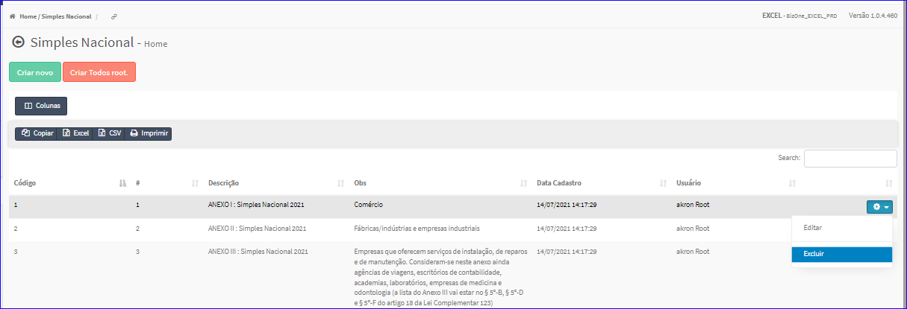

Excluir Simples Nacional
########################
- Esta opção é chamada através da Lista do Simples Nacional exibida na tela principal do Cadastro.
- Para isso, basta selecionar um Simples Nacional da Lista e ir até a Engrenagem situada à direita e escolher a opção **Excluir**.

|imagem15|
   - `Funções da Lista <lista_simples_nacional.html#section>`__
   - Após escolhido o Simples Nacional o sistema irá questionar o usuário quanto ao registro.

|imagem16|
   - Depois de clicado em **Sim** o sistema atualizará a lista.

.. |imagem16| image:: imagens/Simples_Nacional_16.png
