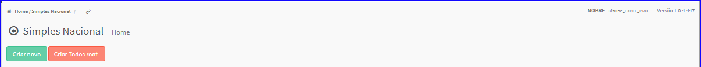

Simples Nacional
################
No Menu (Superior ou Esquerdo) acesse a opção **Cadastros -> Tributação -> Simples Nacional**.
   * O sistema irá apresentar uma tela conforme exemplo abaixo.

|imagem1|
   * Tela sem nenhuma simples nacional cadastrado.

|imagem2|
   - Tela com simples nacionais cadastrados.
   - `Funções da Lista <lista_simples_nacional.html#section>`__

.. toctree::
   :maxdepth: 2

   criar_simples_nacional
   criar_todos_root_simples_nacional
   editar_simples_nacional
   excluir_simples_nacional

.. |imagem2| image:: imagens/Simples_Nacional_2.png
