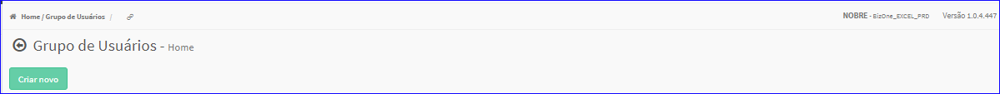
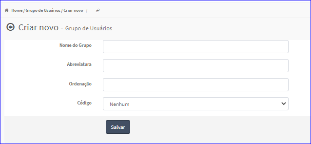
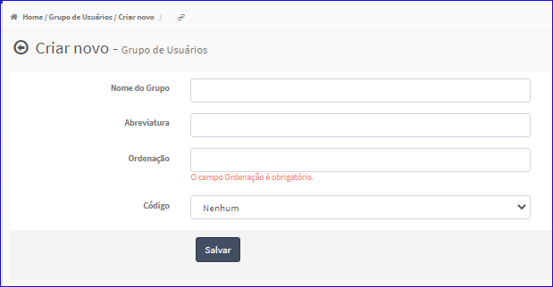

Criar Grupo de Usuários
#######################
- Permite gerar um novo Grupo de Usuários.

- Essa opção é chamada através do botão **Criar Novo** da tela principal do Cadastro de Grupo de Usuários.

|imagem1|

- Após clicar no botão, o sistema irá abrir uma nova tela para a criação do cadastro.

|imagem3|
   * Caso os dados não forem informados corretamente, são exibidas as mensagens.

|imagem4|
   * Após informado corretamente os dados e clicado em **Salvar**, o sistema voltará para a tela de cadastro e atualizará a lista dos Usuários.

