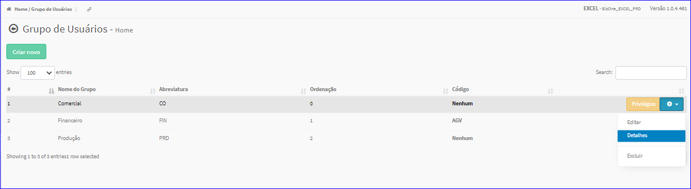
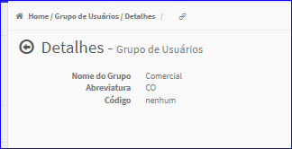

Detalhes Grupo de Usuários
##########################
- Mostrará um resumo com os dados do Grupo.
- Esta tela é chamada através da Lista dos Grupos de Usuários exibido na tela principal do Cadastro.
- Para isso, basta selecionar um Grupo de Usuários da Lista e ir até a Engrenagem situada à direita e escolher a opção **Detalhes**.

|imagem11|
   - Após o sistema irá abrir uma nova tela com o Grupo de Usuários escolhido anteriormente.

|imagem12|

