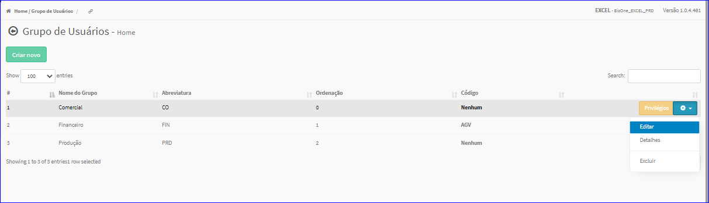
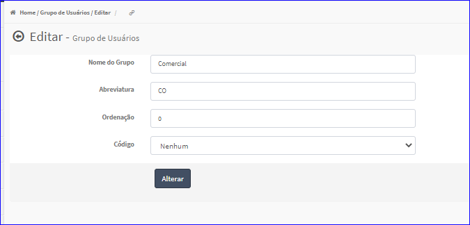

Editar Grupo de Usuários
########################
- A tela da Edição permite alterar os dados de um Grupo de Usuários.

- Esta tela é chamada através da Lista dos Grupos de Usuários exibido na tela principal do Cadastro.
- Para isso, basta selecionar um Grupo de Usuários da Lista e ir até a Engrenagem situada à direita e escolher a opção **Editar**.

|imagem9|
   - Após o sistema irá abrir uma nova tela com o Grupo de Usuários escolhido anteriormente.

|imagem10|
   - O botão **Alterar** irá atualizar todas as modificações efetuadas.

