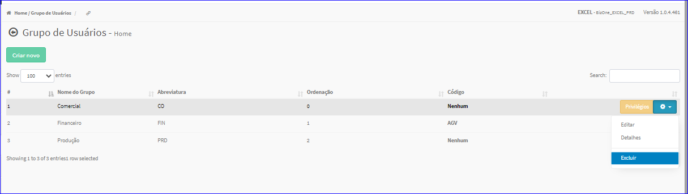
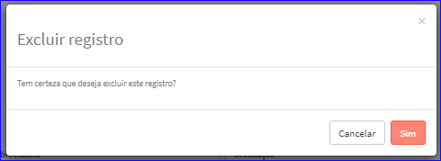

Excluir Grupo de  Usuários
##########################
- Esta opção é chamada através da Lista dos Grupos de Usuários exibida na tela principal do Cadastro.
- Para isso, basta selecionar um Grupo de Usuários da Lista e ir até a Engrenagem situada à direita e escolher a opção **Excluir**.

|imagem13|
   - Após escolhido o Grupo de Usuário o sistema irá questionar o usuário quanto ao registro.

|imagem14|
   - Depois de clicado em **Sim** o sistema atualizará a lista.

