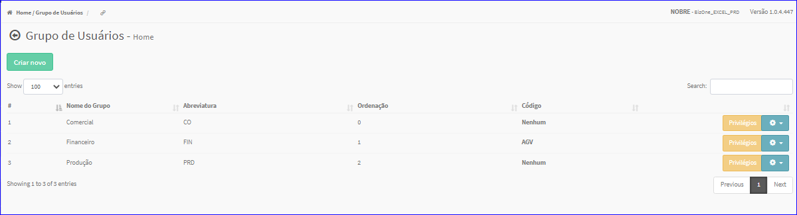

Grupos de Usuários
#################
- No Menu (Superior ou Esquerdo) acesse a opção **Cadastros -> Usuários -> Grupos de Usuários**.
   * O sistema irá apresentar uma tela conforme exemplo abaixo.

|imagem1|

- Após a definição do Indicador, os resultados serão apresentados conforme exemplo.

|imagem2|

.. toctree::
   :maxdepth: 2

   criar_grupos_usuarios
   editar_grupos_usuarios
   excluir_grupos_usuarios

.. |imagem1| image:: imagens/Grupos_Usuarios_1.png

