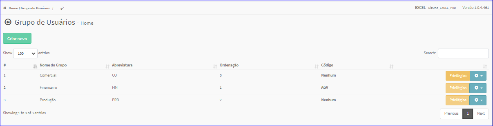
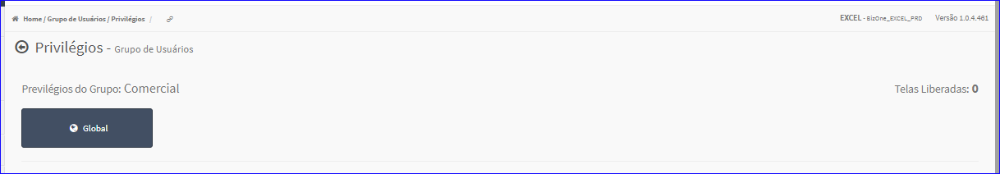
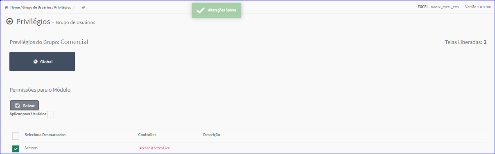

Privilégios Grupo de Usuários
#############################
- Permite administrar os acessos do Grupo de Usuários.

- Essa opção é chamada através do botão **Privilégios** da Lista dos Grupos de Usuários da tela principal do Cadastro de Grupo de Usuários.

|imagem5|

- Após clicar no botão, o sistema irá abrir uma nova tela para a definição dos acessos.

|imagem6|
   
- Ao clicar no botão **Global** a tela irá mostrar os acessos disponíveis.

|imagem7|
   * Após definir os acessos é só clicar em **Salvar**, o sistema atualizará os dados.

|imagem8|

.. |imagem7| image:: imagens/Grupos_Usuarios_7.png

