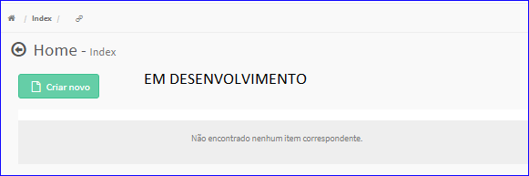

Turnos
######
- No Menu (Superior ou Esquerdo) acesse a opção **Cadastros -> Usuários -> Turnos**.
   * O sistema irá apresentar uma tela conforme exemplo abaixo.

|imagem1|
   * Tela sem nenhuma turno cadastrada.

|imagem2|
   - Tela com turnos cadastrados.
   - `Funções da Lista <lista_turnos.html#section>`__

.. toctree::
   :maxdepth: 2

   criar_turnos
   editar_turnos
   excluir_turnos

.. |imagem1| image:: imagens/Turnos_1.png

