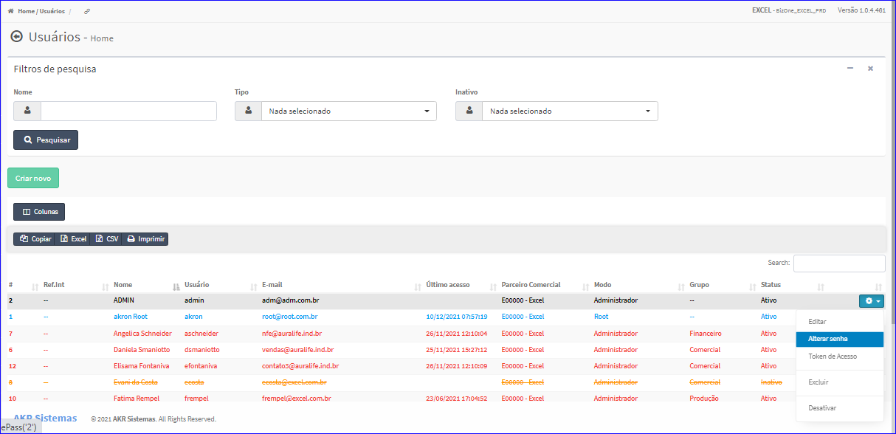
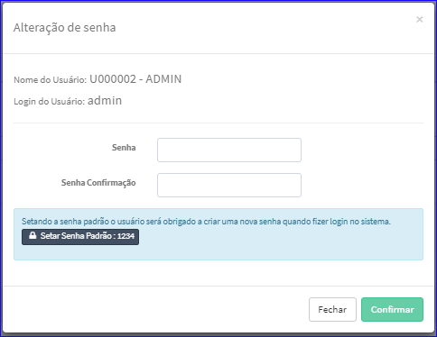

Alterar Senha usuário
#####################
- Esta tela é chamada através da Lista dos usuários exibido na tela principal do Cadastro.
- Para isso, basta selecionar um Usuário da Lista e ir até a Engrenagem situada à direita e escolher a opção **Alterar senha**.

|imagem9|
   - `Funções da Lista <lista_usuarios.html#section>`__
   - Após o sistema irá abrir uma nova tela com o Usuário escolhida anteriormente.   

|imagem10|
   - O botão **Confirmar** irá atualizar a senha.

