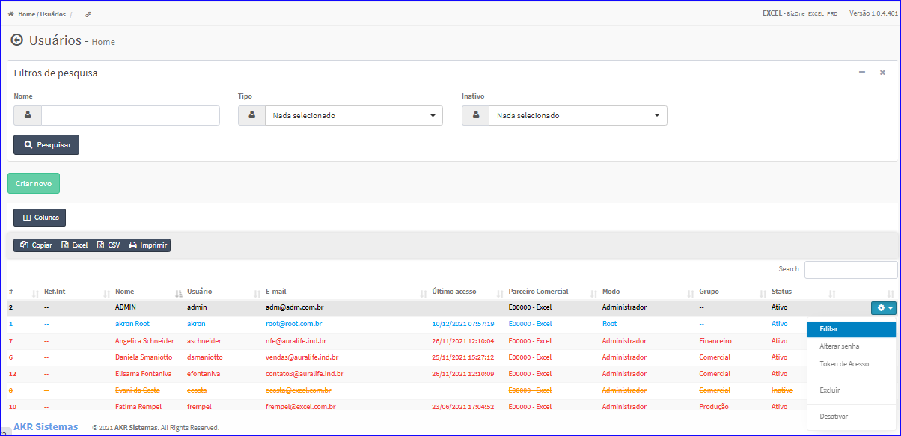
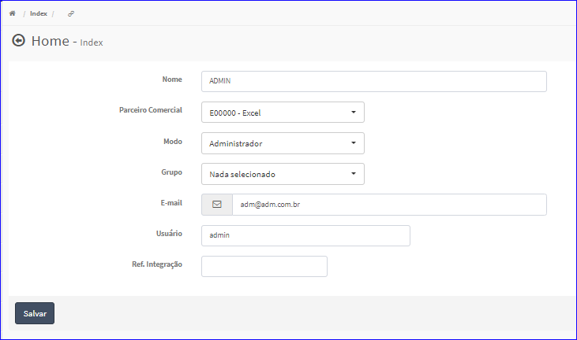

Editar usuário
##############
- A tela da Edição permite alterar os dados de um Usuário.

- Esta tela é chamada através da Lista dos usuários exibido na tela principal do Cadastro.
- Para isso, basta selecionar um Usuário da Lista e ir até a Engrenagem situada à direita e escolher a opção **Editar**.

|imagem7|
   - `Funções da Lista <lista_usuarios.html#section>`__
   - Após o sistema irá abrir uma nova tela com o Usuário escolhida anteriormente.   

|imagem8|
   - O botão **Salvar** irá atualizar todas as modificações efetuadas.

