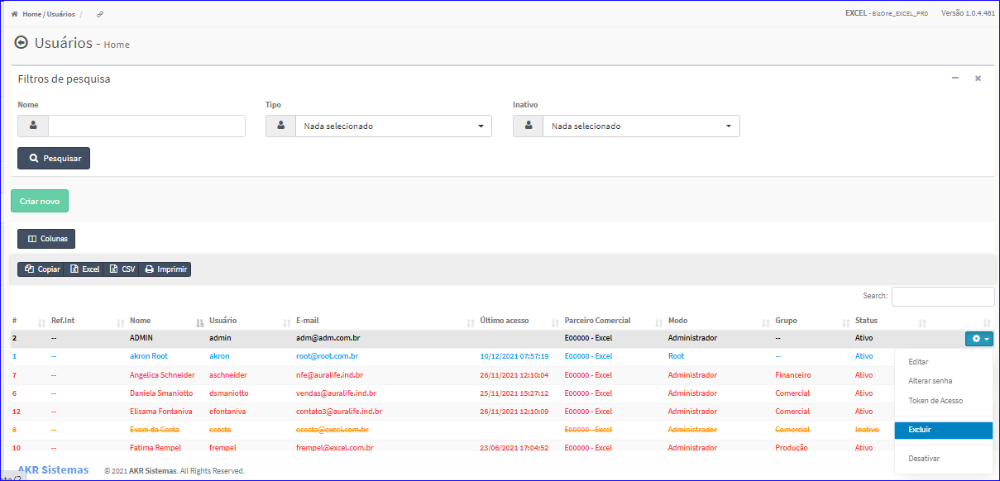
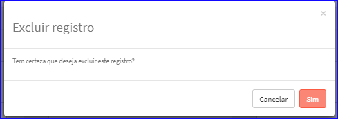

Excluir Usuário
###############
- Esta opção é chamada através da Lista dos Usuários exibida na tela principal do Cadastro.
- Para isso, basta selecionar um Usuário da Lista e ir até a Engrenagem situada à direita e escolher a opção **Excluir**.

|imagem14|
   - `Funções da Lista <lista_usuarios.html#section>`__
   - Após escolhido o Usuário o sistema irá questionar o usuário quanto ao registro.

|imagem15|
   - Depois de clicado em **Sim** o sistema atualizará a lista.

