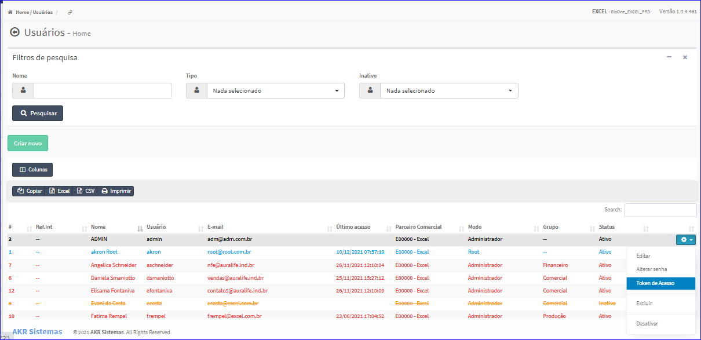
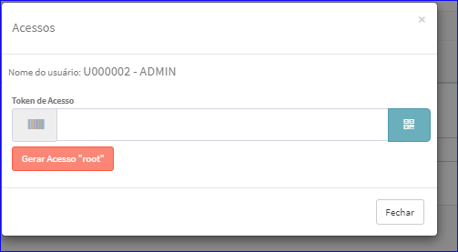
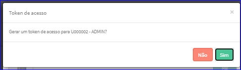

Token de Acesso Usuário
#######################
- Esta tela é chamada através da Lista dos usuários exibido na tela principal do Cadastro.
- Para isso, basta selecionar um Usuário da Lista e ir até a Engrenagem situada à direita e escolher a opção **Token de Acesso**.

|imagem11|
   - `Funções da Lista <lista_usuarios.html#section>`__
   - Após o sistema irá abrir uma nova tela com o Usuário escolhida anteriormente.   

|imagem12|
   - Após informar os dados, e clicado em **Gerar Acesso "root"**, o sistema questionará o usuário.

|imagem13|
   - Após clicado em **Sim**, os dados serão atualizados.

