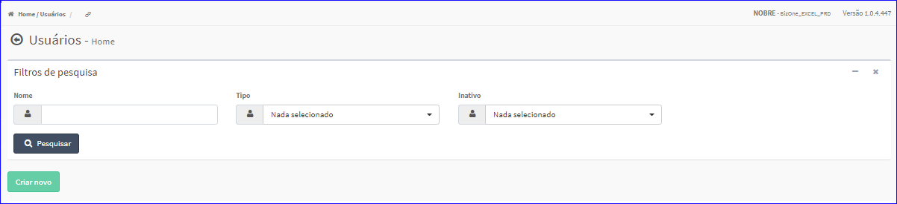
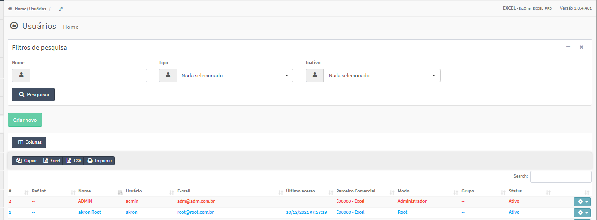

Usuários
########
- No Menu (Superior ou Esquerdo) acesse a opção **Cadastros -> Usuários -> Usuários**.
   * O sistema irá apresentar uma tela conforme exemplo.

|imagem1|
- Esta tela permite efetuar pesquisa utilizando os filtros:
   * Nome;
   * Tipo;
   * Inativo.
   
- Caso o usuário não queira informar nenhum filtro, basta clicar em **Pesquisar**.
   
- Os resultados serão apresentados conforme exemplo.

|imagem2|
   - `Funções da Lista <lista_usuarios.html#section>`__

.. toctree::
   :maxdepth: 2

   criar_usuarios
   editar_usuarios
   alterar_senha_usuarios
   token_acesso_usuarios
   excluir_usuarios
   desativar_usuarios

