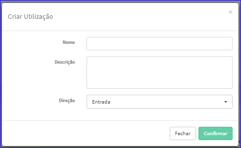

Criar Utilização
################
- Permite gerar uma nova Utilização.
- São usados em Documentos de Entrada ou Documentos de Saída.

- Essa opção é chamada através do botão **Criar Novo** da tela principal do Cadastro de Utilizações.

|imagem0|

- Após clicar no botão, o sistema irá abrir uma nova tela para a criação do cadastro.

|imagem5|
   * Após informado corretamente os dados e clicado em **Confirmar**, o sistema abrirá a tela Edição da Utilização.

.. |imagem0| image:: imagens/Utilizacoes_0.png

