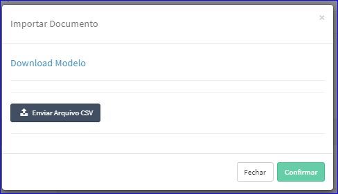
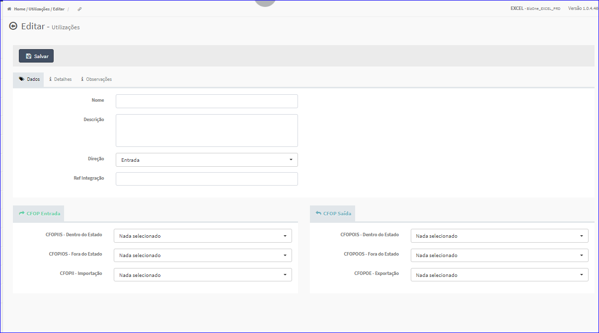
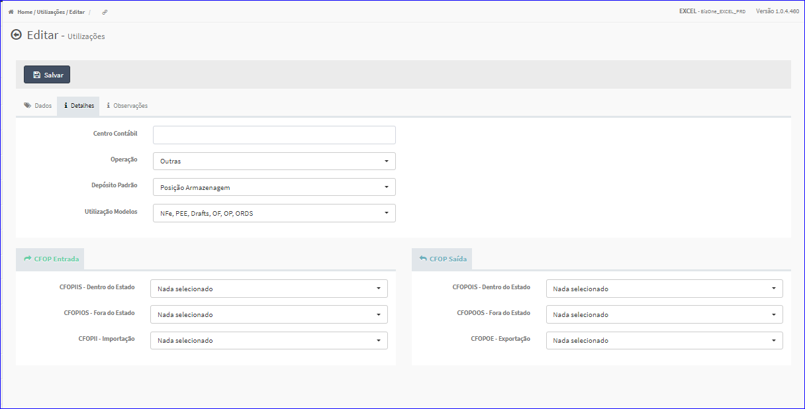
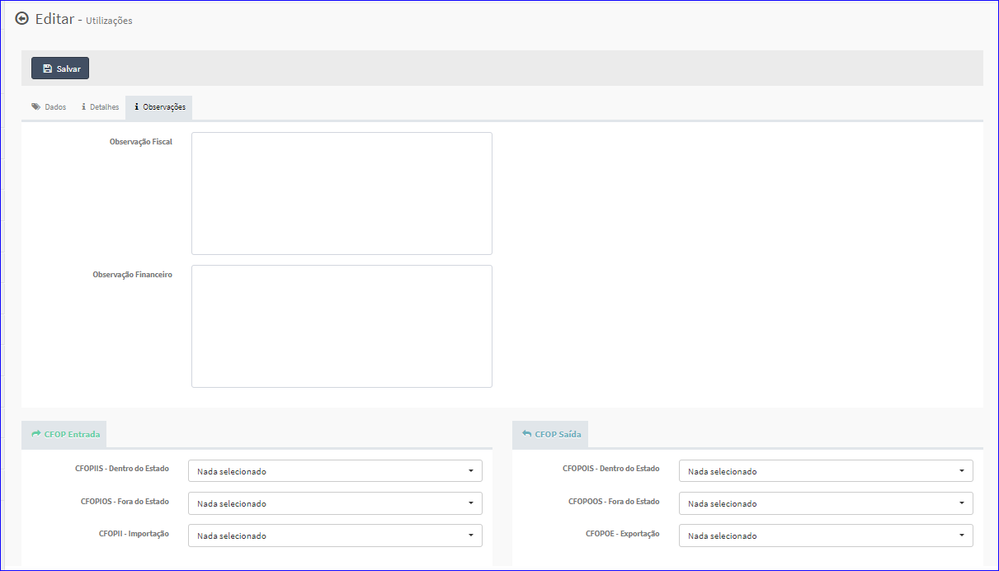

Editar Utilização
#################
- A tela da Edição permite alterar os dados de uma Utilização.

- Esta tela é chamada através da Lista das Utilizações exibida na tela principal do Cadastro.
- Para isso, basta selecionar uma Utilização da Lista e ir até a Engrenagem situada à direita e escolher a opção **Editar**.

|imagem6|
   - `Funções da Lista <lista_utilizacoes.html#section>`__
   - Após o sistema irá abrir uma nova tela com a Utilização escolhida anteriormente.   

- **Dados**

|imagem9|
   - Permite informar os dados referentes ao tipo de documento e aos impostos.

- **Detalhes**

|imagem10|
   - Permite informar os dados referentes ao tipo de depósito, modelos e aos impostos.

- **Observações**

|imagem11|
   - Permite informar os dados referentes as observações e aos impostos.

- O botão **Salvar** irá atualizar todas as modificações efetuadas.

