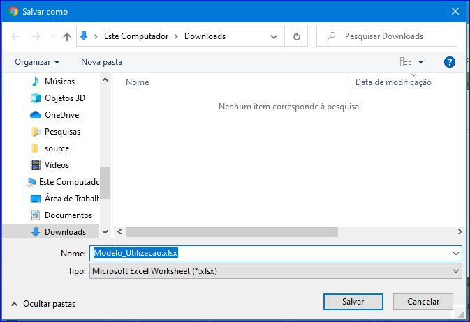

Importar CSV
############
- Permite importar modelo de Utilização.

- Essa opção é chamada através do botão **Importar CSV** da tela principal do Cadastro de Utilizações.

|imagem0|

- Após clicar no botão, o sistema irá abrir uma nova tela.

|imagem6|
   - **Download Modelo**
   - **Enviar Arquivo CSV**

      - Ambas opções abrirão uma tela para escolher um arquivo para baixar ou vincular os dados de uma Promoção.

|imagem7|

.. |imagem0| image:: imagens/Utilizacoes_0.png

.. |imagem6| image:: imagens/Utilizacoes_6.png

