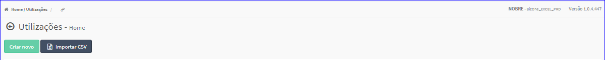
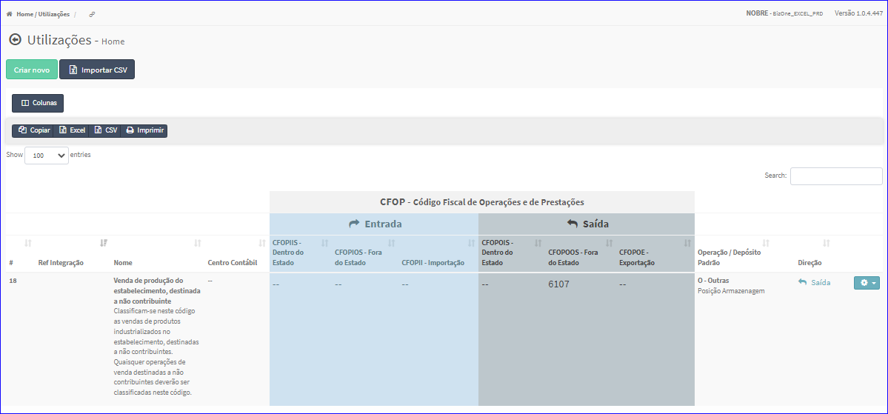

Utilizações
###########
No Menu (Superior ou Esquerdo) acesse a opção **Cadastros -> Utilizações**.
   * O sistema irá apresentar uma tela conforme exemplo abaixo.

|imagem0|
   * Tela sem nenhuma utilização cadastrada.

|imagem1|
   - Tela com utilizações cadastradas.
   - `Funções da Lista <lista_utilizacoes.html#section>`__

.. toctree::
   :maxdepth: 2

   criar_utilizacoes
   importar_csv_utilizacoes
   editar_utilizacoes
   excluir_utilizacoes

