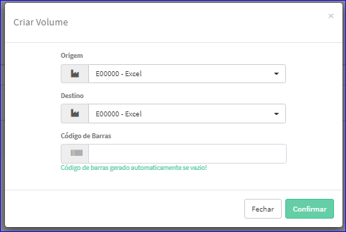

Criar Volume
############
- Permite gerar um novo Volume.

- Essa opção é chamada através do botão **Criar Novo** da tela principal do Cadastro de Volumes.

|imagem1|

- Após clicar no botão, o sistema irá abrir uma nova tela para a criação do cadastro.

|imagem5|
   * Após informado corretamente uma Descrição e clicado em **Confirmar**, o sistema automaticamente abrirá a tela de Editar Volumes.

.. |imagem1| image:: imagens/Volumes_1.png

