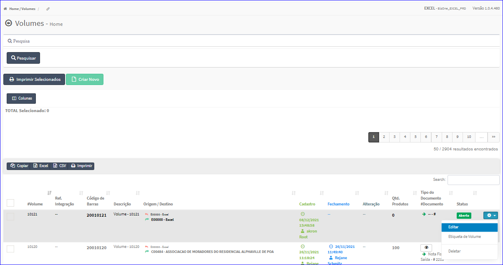
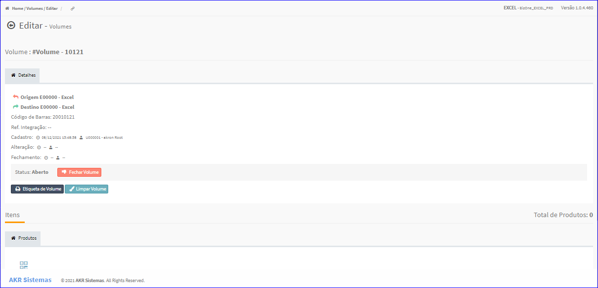
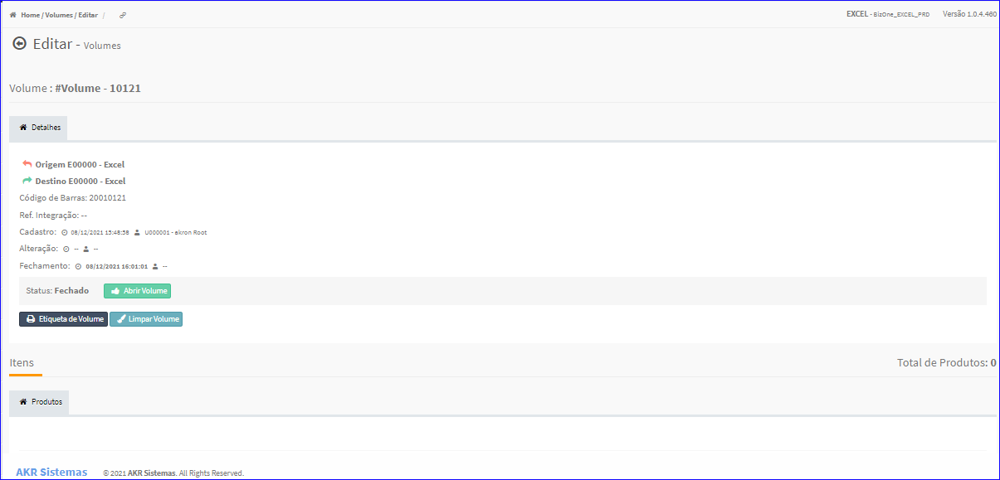
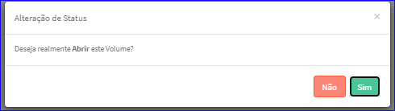
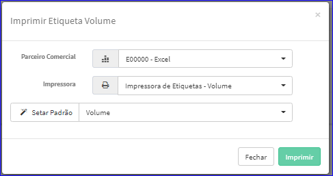
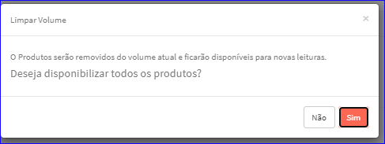
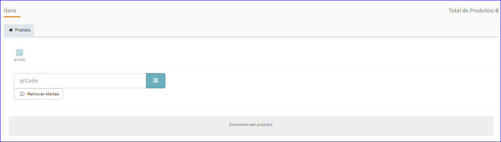
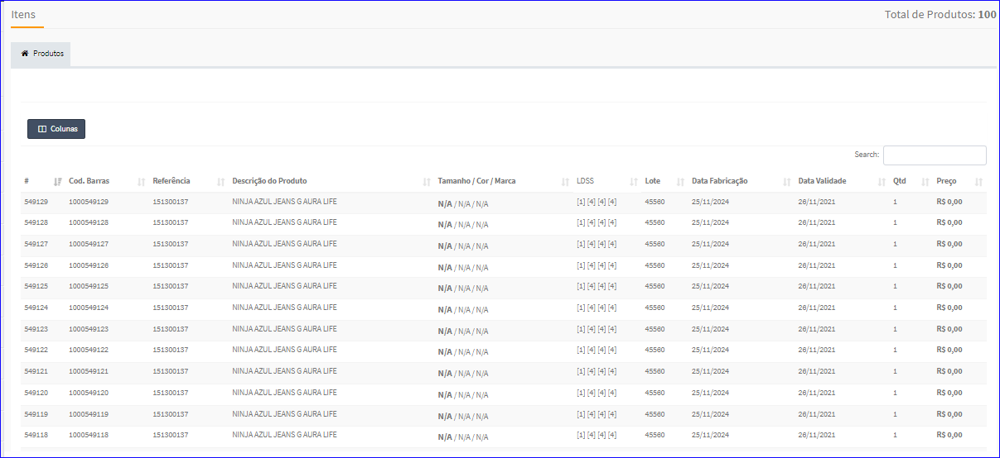

Editar Volumes
##############
- A tela da Edição permite alterar os dados de um Volume.

- Esta tela é chamada através da Lista dos Volumes exibida na tela principal do Cadastro.
- Para isso, basta selecionar um Volume da Lista e ir até a Engrenagem situada à direita e escolher a opção **Editar**.

|imagem9|
   - `Funções da Lista <lista_volumes.html#section>`__
   - Após o sistema irá abrir uma nova tela com o Volume escolhido anteriormente.   

|imagem10|

- **Fechar Volume**
   - Quando o Status do Volume estiver aberto, o usuário poderá fechá-lo.

|imagem11|

- **Abrir Volume**

|imagem12|
   - Quando o Status do Volume estiver fechado, o usuário poderá abri-lo.

|imagem13|

- **Etiqueta de Volume**

|imagem14|
   - O botão **Imprimir** efetua a impressão dos dados.

- **Limpar Volume**
   - Efetua a limpeza de todos os volumes.

|imagem15|

- **Itens**

|imagem16|
   - Permite incluir produtos através do QRCode.

|imagem17|
   - Volume com Produtos cadastrados.
   - `Funções da Lista <lista_volumes_itens.html#section>`__

.. |imagem11| image:: imagens/Volumes_11.png

