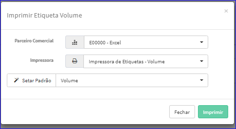
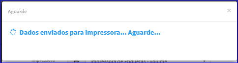
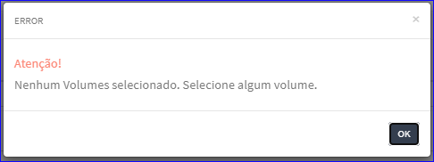
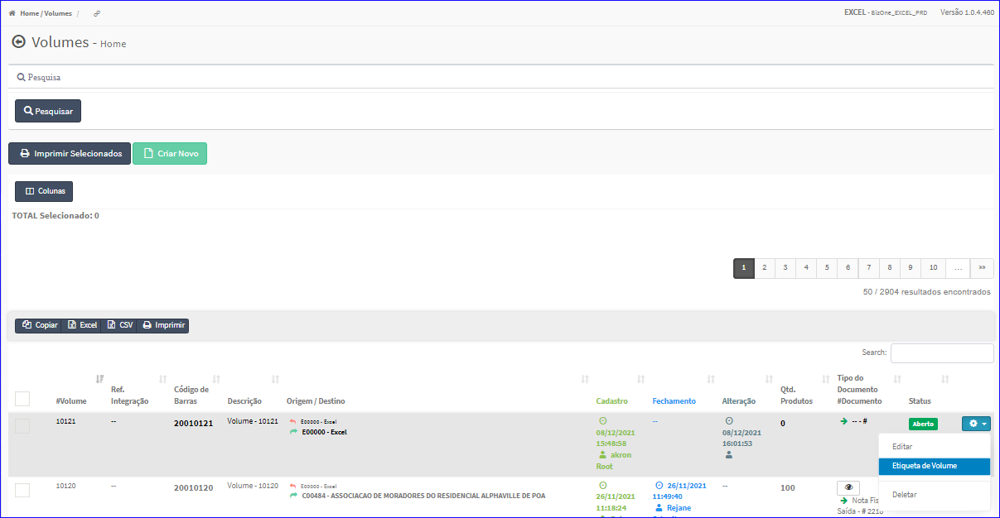

Etiqueta de Volume
##################
- A tela Principal do Cadastro permite que o usuário selecione um volume da lista para a impressão de etiqueta.

|imagem19|
   - `Funções da Lista <lista_volumes.html#section>`__
   - Após o sistema irá abrir uma nova tela para a definição do Parceiro Comercial, Impressora e o parâmetro Padrão para que a impressão possa ser efetuada.

|imagem7|
   - O botão **Imprimir** efetuar a impressão dos dados.

|imagem8|

- Caso o usuário tente Imprimir Etiquetas sem ter marcado produtos, o sistema informará com uma mensagem.

|imagem8a|

