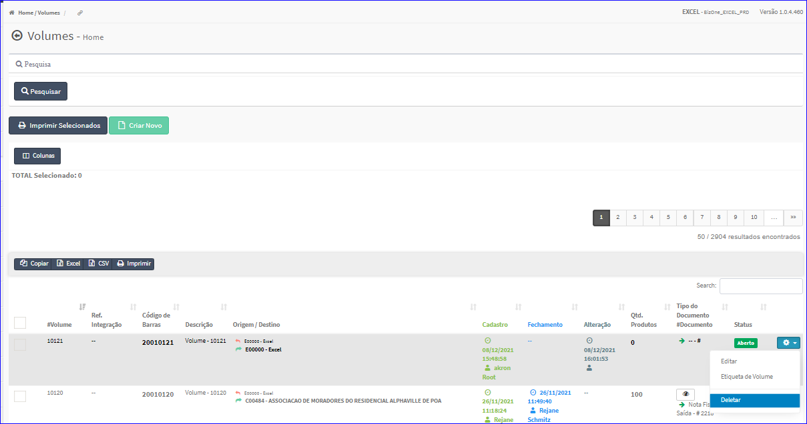
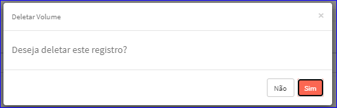

Excluir Volume
##############
- A tela da principal do Cadastro permite efetuar a exclusão de um Volume.
- Para isso, basta selecionar um Volume da Lista e ir até a Engrenagem situada à direita e escolher a opção **Deletar**.

|imagem20|
   - `Funções da Lista <lista_volumes.html#section>`__
   - Após escolhido o Volume o sistema irá questionar o usuário quanto ao registro.

|imagem20a|
   - Depois de clicado em **Sim** o sistema atualizará a lista da tela.

