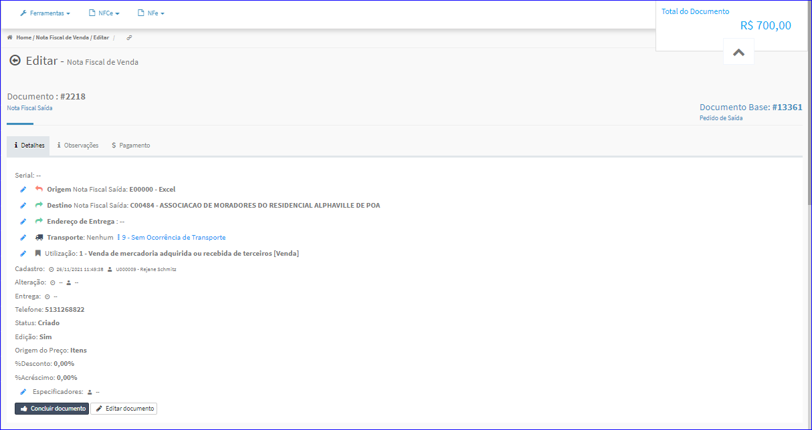

Tipo de Documento
#################
- Essa opção é chamada através do ícone que está na coluna **Tipo de Documento** da Lista de Volumes da tela principal do Cadastro de Volumes.

|imagem21|

- Após clicar no ícone, o sistema irá abrir uma nova tela para efetuar as operações no Documento.

|imagem22|

.. |imagem21| image:: imagens/Volumes_21.png

