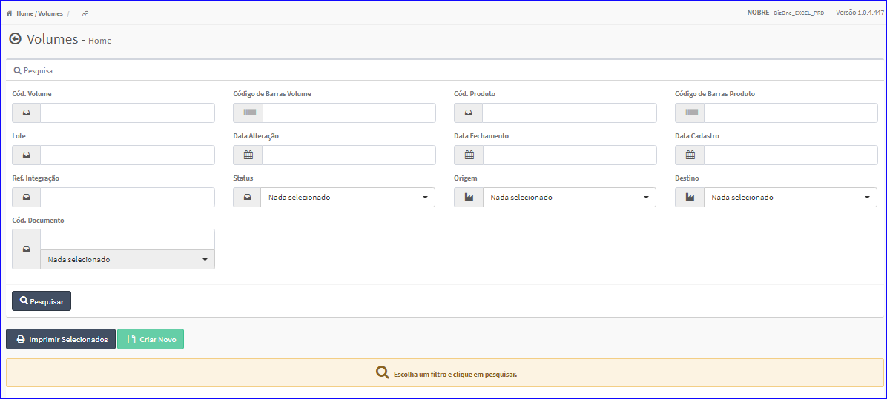
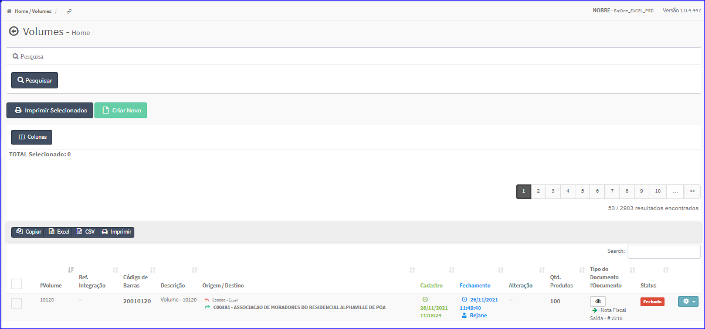

Volumes
#######
No Menu (Superior ou Esquerdo) acesse a opção **Cadastros -> Volumes**.
   * O sistema irá apresentar uma tela conforme exemplo abaixo.

|imagem1|
- Esta tela permite efetuar pesquisa utilizando os filtros:
   * Código do Produto;
   * Código de Barras;
   * Lote;
   * Referência Integração;
   * Tipo Produto;
   * Referência;
   * Referência Pai;
   * Referência Fornecedor;
   * Linha;
   * Departamento;
   * Seção;
   * Subseção;
   * Fornecedor;
   * Tamanho;
   * Cor;
   * Depósito;
   * Depósito Padrão;
   * Marca;
   * Tipo Utilização;
   * Data Cadastro;
   * Data Validade;
   * Data Fabricação;
   * Código Documento;
   * Etiquetas Geradas.
   
- Caso o usuário não queira informar nenhum filtro, basta clicar em **Pesquisar**.
   
- Os resultados serão apresentados conforme exemplo.

|imagem2|
   - `Funções da Lista <lista_volumes.html#section>`__

.. toctree::
   :maxdepth: 2

   criar_volumes
   editar_volumes
   excluir_volumes
   lista_volumes

