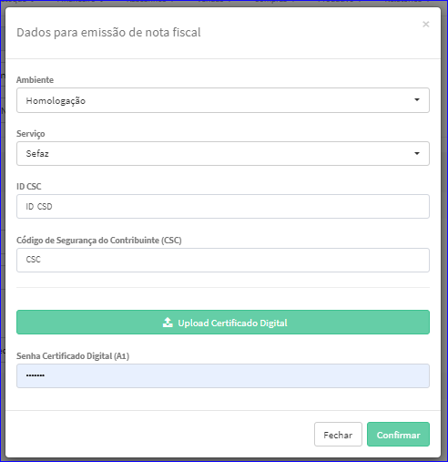

Dados para Emissão de Nota Fiscal
#################################
- Definição dos dados relativos a Ambiente, Serviço, Segurança e Certificado.

- Esta opção é chamada através do botão **Adicionar** dentro da Aba Adicionar do Sefaz na tela Editar Parceiro Comercial.

  |imagem31|
  
 - Após o sistema abrirá uma nova tela para efetuar o cadastro.
 
 |imagem32|
 
 - Após preencher os dados é necessário informar um Certificado.
 - Para isso basta clicar em **Upload Certificado Digital** que o sistema abrirá o Sistema de Arquivos para que o usuário localize o Certificado.
 - Depois de informado todos os dados é só clicar em **Salvar** que a janela se fechará e a tela atualizará a Lista dos Certificados.
 
 |imagem34|

.. |br| raw:: html
   
    

.. |imagem31| image:: imagens/Parceiro_Comercial_31.png

.. |imagem34| image:: imagens/Parceiro_Comercial_34.png
