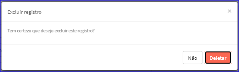

Excluir Contato
###############
- A tela da Edição permite alterar os dados de um Contato.

- Esta tela é chamada através da Lista dos Contatos da tela Editar Parceiro Comercial.
- Para isso, baste selecionar um Contato da Lista e ir até a Engrenagem situada à direita e escolher a opção **Deletar**.
|imagem19|
   
- Após escolhido o Contato o sistema irá questionar o usuário quanto ao registro.
|imagem20|
   - Depois de clicado em **Deletar** o sistema atualizará a lista da tela Editar Parceiro Comercial.

.. |br| raw:: html
   
    

.. |imagem19| image:: imagens/Parceiro_Comercial_19.png

