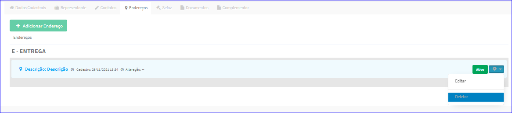
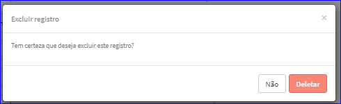

Excluir Endereço
################
- A tela Editar Parceiro Comercial permite excluir um Endereço.

- Para isso, baste selecionar um Endereço da Lista e ir até a Engrenagem situada à direita e escolher a opção **Deletar**.
|imagem28|
   
- Após escolhido o Endereço o sistema irá questionar o usuário quanto ao registro.
|imagem29|
   - Depois de clicado em **Deletar** o sistema atualizará a lista da tela Editar Parceiro Comercial.
   
- Após as alterações efetuadas, basta clicar no botão **Salvar** da tela Editar Parceiro Comercial.

.. |br| raw:: html
   
    

