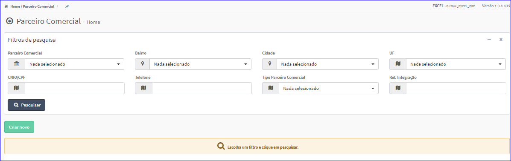

Parceiro Comercial
##################
No `Menu (Superior ou Esquerdo) <menus.html#section>`__ acesse a opção **Cadastros -> Parceiro Comercial -> Parceiro Comercial**.
   * O sistema irá apresentar uma tela conforme exemplo abaixo.

|imagem1|
- Esta tela permite efetuar pesquisa utilizando os filtros:
   * Parceiro Comercial;
   * Bairro;
   * Cidade;
   * UF;
   * CNPJ/CPF;
   * Telefone;
   * Tipo Parceiro Comercial;
   * Ref. Integração.
   
- Caso o usuário não queira informar nenhum filtro, basta clicar em **Pesquisar**.
   
- Os resultados serão apresentados conforme exemplo.

|imagem4|
   - `Funções da Lista <funcoes_lista.html#section>`__

.. toctree::
   :maxdepth: 2

   criar_parceiro_comercial
   editar_parceiro_comercial
   excluir_parceiro_comercial

.. |br| raw:: html
   
    

.. |imagem4| image:: imagens/Parceiro_Comercial_4.png
