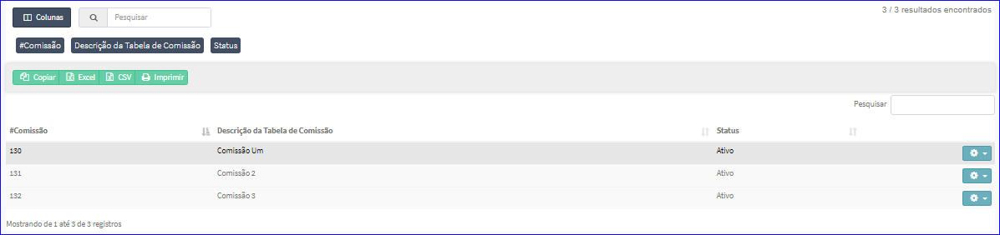
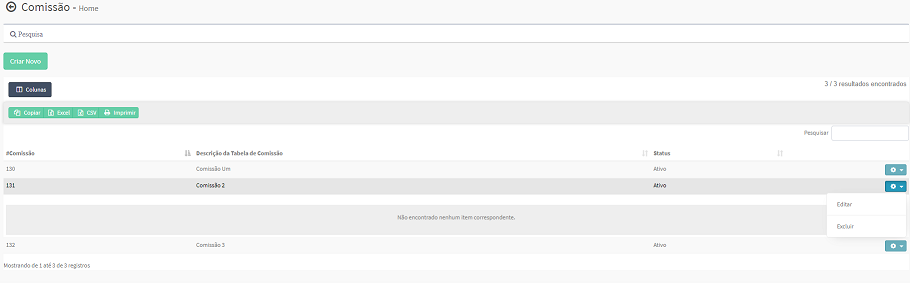
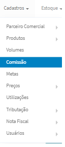

Cadastro de Comissões
=====================
No `Menu Superior`_ ou `Menu Esquerdo`_ acesse a opção CADASTROS - COMISSÃO.
   O sistema irá apresentar uma tela conforme exemplo abaixo.

|imagem1|

Esta tela permite efetuar pesquisa utilizando os filtros:
   * Número da Comissão;
   * Descrição da Comissão;
   * Status da Comissão.
   
Caso o usuário não queira informar nenhum filtro, basta clicar em PESQUISAR.
   
A tela também permite `Criar Comissão`_.

Os resultados serão apresentados conforme exemplo.

|imagem2|

O usuário ainda pode informar quais as `Colunas da Lista`_ que quer visualizar na lista das Comissões.

A lista também permite a `Impressão dos Resultados`_ das Comissões.

Ao selecionar uma Comissão da Lista, o sistema automaticamente irá exibir os Itens desta Comissão, caso houver.
|imagem11|

Após a pesquisa realizada o usuário poderá efetuar as operações de `Editar Comissão`_ ou `Excluir Comissão`_.
Para executar uma destas opções, basta selecionar a Engrenagem situada à direita ou clicar com o botão direito na linha do item a ser selecionado.

--------------
Criar Comissão
--------------
A funcionalidade permite gerar um novo código de Comissão.

|imagem3|

O sistema valida a descrição informada pelo usuário.
Caso não for informada descrição ou informada menos de 2 caracteres, é exibida a mensagem.

|imagem4|

Após informado corretamente uma descrição, o sistema automaticamente abrirá a tela de `Editar Comissão`_.

---------------
Editar Comissão
---------------
A tela da Edição permite alterar o Status e/ou `Criar Novo Item`_ para uma Comissão.

|imagem5|

O Botão SALVAR irá atualizar o Status da Comissão, a Descrição não poderá ser alterada.

----------------
Excluir Comissão
----------------
Ao selecionar um item da Lista, o sistema permite Excluir a Comissão, desde que NÃO esteja em Período de Vigência Ativo.

|imagem8|

Após excluída uma Comissão, a lista automaticamente será atualizada.

---------------
Criar Novo Item
---------------

----------------
Colunas da Lista
----------------
|imagem6|

------------------------
Impressão dos Resultados
------------------------
|imagem7|

-------------
Menu Superior
-------------
|imagem9|

-------------
Menu Esquerda
-------------
|imagem10|

.. |imagem1| image:: comissao_1.png

.. |imagem2| image:: comissao_2.png

.. |imagem3| image:: Criar_Comissao.png

.. |imagem4| image:: Criar_Comissao_2.png

.. |imagem5| image:: Editar_Comissao.png

.. |imagem7| image:: Impressao_Resultados.png

.. |imagem10| image:: Menu_Esquerda.png

.. |imagem11| image:: Itens_Comissao.png
